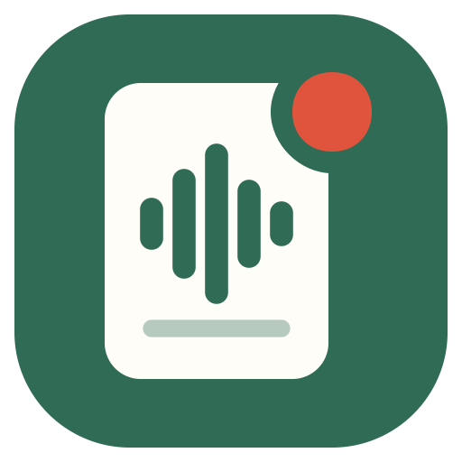
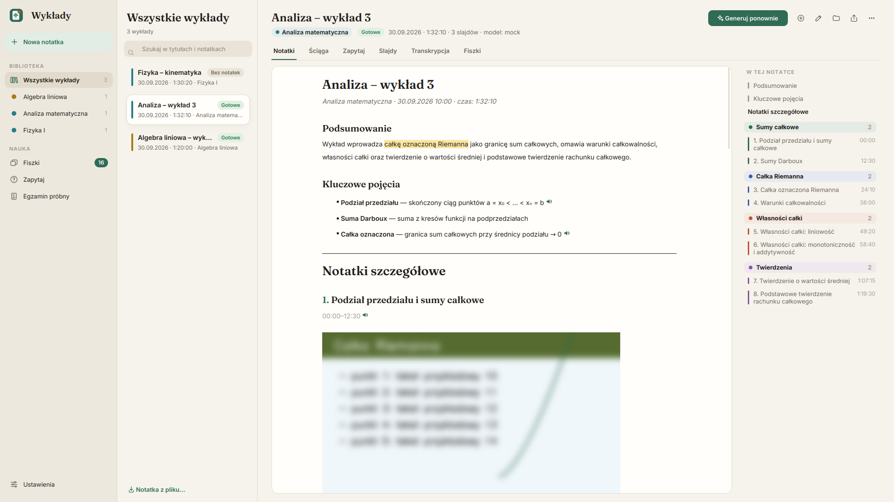
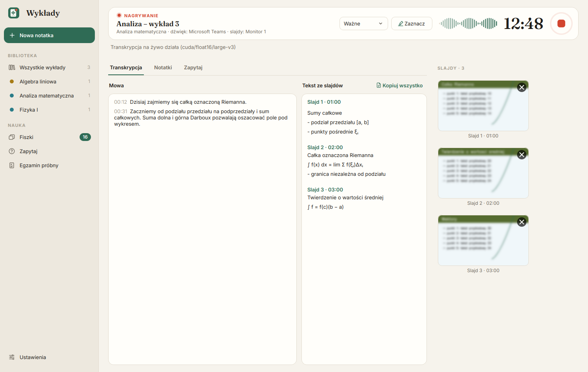
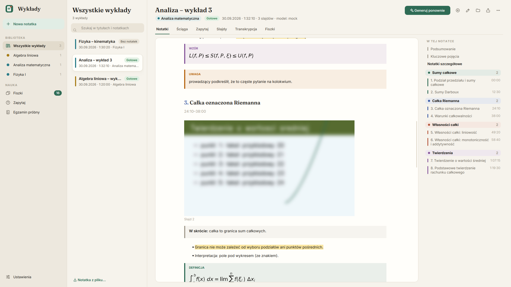
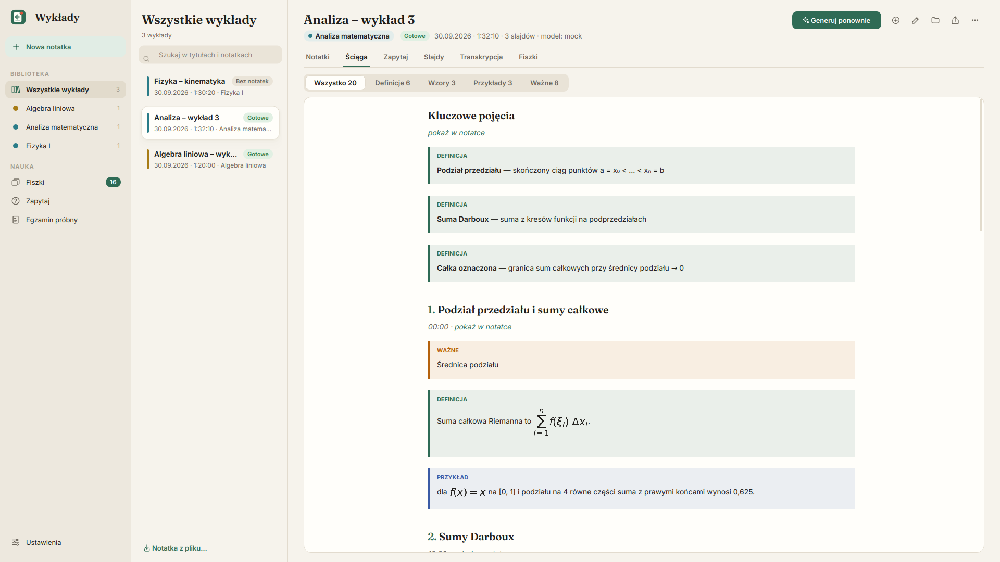
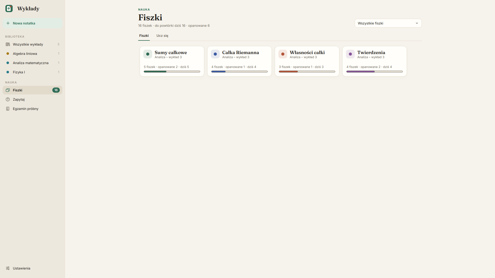
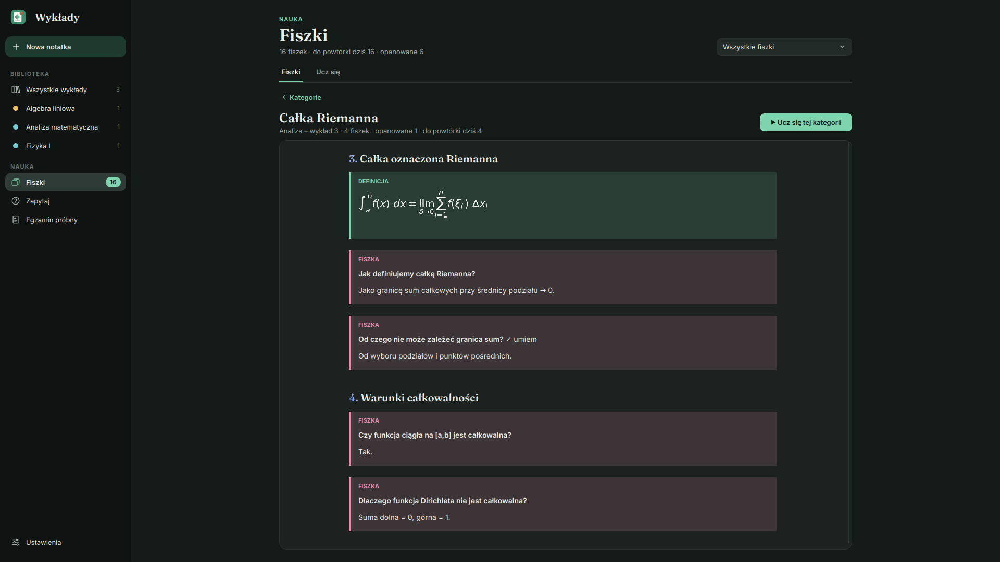
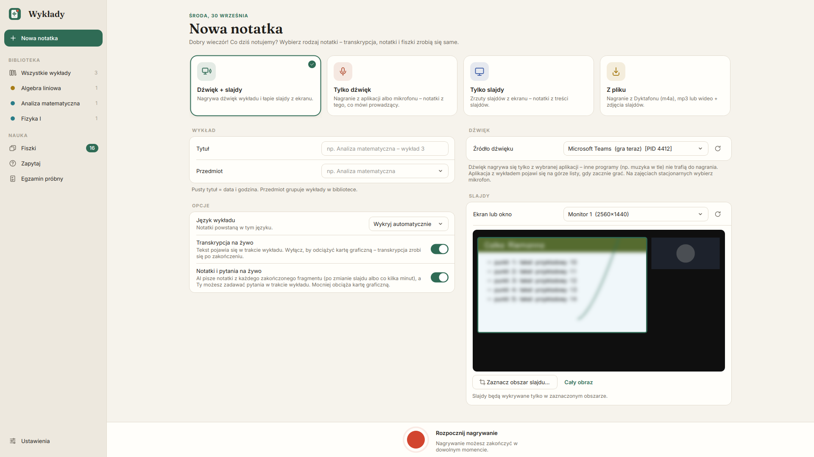

  

<h1 align="center">Wykłady</h1>

  <b>Nagrywa wykład, łapie slajdy i sam robi z tego notatki, ściągę i fiszki.</b> 
  Wszystko lokalnie na Twoim komputerze – bez kont, kluczy API i opłat.

  
  
  
  

  

> Zrzuty ekranu pochodzą z przykładowych danych. Obrazy slajdów są celowo rozmyte.

---

## Co potrafi

| | |
|---|---|
| 🎙️ **Nagrywanie tylko wybranej aplikacji** | Dźwięk z Teams, Chrome albo Zoom – to, co oglądasz obok w innej aplikacji, nie trafia do nagrania. Albo mikrofon na wykładzie stacjonarnym. |
| ✍️ **Transkrypcja na żywo** | Whisper large-v3 na karcie NVIDIA, po polsku i po angielsku. |
| 🖼️ **Slajdy z ekranu** | Wykrywa zmianę slajdu, zapisuje zrzut z godziną i czyta z niego tekst. Rozpoznaje powroty do slajdu i slajdy z animacją. Niechciany zrzut (np. kamerkę) usuwasz jednym „×”. |
| 📒 **Notatki od AI** | Ollama + polski model Bielik: podsumowanie, tematy z „W skrócie”, zakreślone najważniejsze fakty, ramki *Definicja / Wzór / Przykład / Ważne*, opisy zdjęć i wykresów ze slajdów. |
| 🗂️ **Kategorie w kolorach** | Podobne tematy łączą się w kategorie – ten sam kolor w spisie treści, ściądze i fiszkach. |
| 📋 **Ściąga** | Wszystkie definicje, wzory, przykłady i ważne rzeczy w jednym miejscu, z odnośnikiem do miejsca w notatce. |
| 🃏 **Fiszki w kategoriach** | Przeglądanie po kategoriach i tematach albo nauka z powtórkami jak w Anki. |
| ❓ **Zapytaj notatkę** | Odpowiedzi tylko na podstawie notatek, zawsze z cytatem i odnośnikiem. |
| 📝 **Egzamin próbny** | Pytania A–D, prawda/fałsz i otwarte z Twoich wykładów. |
| 📱 **Notatki na telefonie** | Gotowa notatka sama zapisuje się jako PDF w formacie telefonu na Dysku Google. |
| 📂 **Z pliku** | Nagranie z dyktafonu (m4a, mp3, wideo) i zdjęcia slajdów z telefonu – dopasowane do nagrania po godzinie albo po treści. |

## Jak to wygląda

<table>
  <tr>
    <td width="50%"> <b>Nagrywanie</b> – mowa i tekst ze slajdów na żywo, miniatury z „×” do usuwania</td>
    <td width="50%"> <b>Notatka</b> – kolorowe ramki, zakreślenia, opisy slajdów</td>
  </tr>
  <tr>
    <td> <b>Ściąga</b> – definicje, wzory, przykłady i ważne rzeczy z odnośnikami</td>
    <td> <b>Fiszki</b> – kategorie wykładu z postępem nauki</td>
  </tr>
  <tr>
    <td> <b>Kategoria</b> – tematy, definicje i fiszki (motyw „tablica”)</td>
    <td> <b>Nowa notatka</b> – wybór źródła dźwięku i obszaru slajdu</td>
  </tr>
</table>

## Instalacja

1. Pobierz **[Wykłady (zip)](https://github.com/wikingowiec/Notatki-z-wykladow/archive/refs/heads/main.zip)** (albo najnowszy plik z zakładki **Releases**) i rozpakuj w stałym miejscu, np. `C:\Wykłady`.
2. Uruchom **`Wykłady.exe`**. To jedyny plik, którego używasz – folder `_internal` zawiera resztę programu.
3. Przy pierwszym uruchomieniu **ekran z notesem** sam pobierze wszystko, co potrzebne (Python, biblioteki z CUDA, model mowy Whisper, Ollama i modele AI – razem ok. 25 GB). Potem notes się zamyka, otwiera się aplikacja, a na pulpicie pojawia się skrót.

> **„System Windows ochronił ten komputer”** – `Wykłady.exe` nie ma płatnego podpisu. Kliknij **Więcej informacji → Uruchom mimo to** (jednorazowo).

**Wymagania:** Windows 10 (1803+) lub 11, ok. 30 GB miejsca. Zalecana karta NVIDIA (bez niej działa wolniej).

## Jak zacząć

1. **Nowa notatka** → wybierz rodzaj: *Dźwięk + slajdy*, *Tylko dźwięk*, *Tylko slajdy* albo *Z pliku*.
2. Wybierz aplikację z wykładem (musi już grać) i monitor ze slajdami, zaznacz obszar slajdu.
3. Czerwony przycisk – nagrywanie. W trakcie widzisz transkrypcję, tekst ze slajdów i (opcjonalnie) notatki na żywo.
4. Kwadratowy przycisk – koniec. Notatki, ściąga i fiszki zrobią się same w tle.
5. Ucz się w **Fiszkach**, pytaj w **Zapytaj**, sprawdź się w **Egzaminie próbnym**.

📖 Pełny opis wszystkich funkcji: **[docs/PORADNIK.md](docs/PORADNIK.md)**.

## Aktualizacje

**Ustawienia → Aktualizacje → Sprawdź aktualizacje → Zaktualizuj.** Aplikacja sama pobiera nową wersję z tego repozytorium, podmienia pliki i uruchamia się ponownie. Notatki, nagrania i ustawienia zostają bez zmian.

<b>Wydawanie nowej wersji (dla autora)</b>

1. Podbij `VERSION` w `_internal/app/version.py`.
2. Gdy zmieniasz program startowy (`_internal/tools/launcher/launcher.c`): `pip install ziglang` i `python _internal/tools/launcher/build_launcher.py`.
3. `git push`, a najlepiej też **Release** z tagiem `vX.Y.Z`. Bez Release aktualizacja bierze wersję z gałęzi `main`.

## Notatki na telefonie

Zainstaluj **Dysk Google na komputer**, a w **Ustawienia → Notatki na telefonie** kliknij **Użyj Dysku Google**. Każda notatka trafia jako PDF w formacie telefonu do `Mój dysk\Wykłady\<przedmiot>\`. Na telefonie otwierasz ją w aplikacji Dysk Google. Działa też iCloud Drive i OneDrive.

## Jak to działa

| Część | Technologia |
|---|---|
| Interfejs | Python 3.12, PySide6 (Qt 6), własne motywy „zeszyt” i „tablica” |
| Mowa → tekst | faster-whisper (large-v3) na CUDA |
| Notatki, fiszki, pytania | Ollama + Bielik 11B / 4.5B |
| Opisy slajdów | Qwen3-VL 8B (model „widzący” obrazy) |
| Slajdy | wykrywanie zmian obrazu, OCR, porównywanie odcisków obrazu i tekstu |
| Start | mały program `Wykłady.exe` (C), który przy pierwszym uruchomieniu pobiera przenośnego Pythona |

## Gdy coś nie działa

- Uruchom **`Wykłady.exe --debug`**, żeby zobaczyć komunikaty, albo otwórz log w **Ustawienia → Pomoc**.
- `Wykłady.exe --setup` ponownie sprawdza i doinstalowuje biblioteki.
- Więcej w [poradniku](docs/PORADNIK.md#gdy-coś-nie-działa).

> Pamiętaj o zasadach uczelni dotyczących nagrywania zajęć. Nagrania i notatki są do własnej nauki.

---

  Aplikacja stworzona przez <b>Wiktora Wystrychowskiego</b> wyłącznie w celach osobistych – do własnej nauki. 
  <a href="https://github.com/wikingowiec">GitHub</a> ·
  <a href="https://www.linkedin.com/in/wystrychowski/">LinkedIn</a> ·
  <a href="https://www.wystrychowski.pl/">Portfolio</a>

